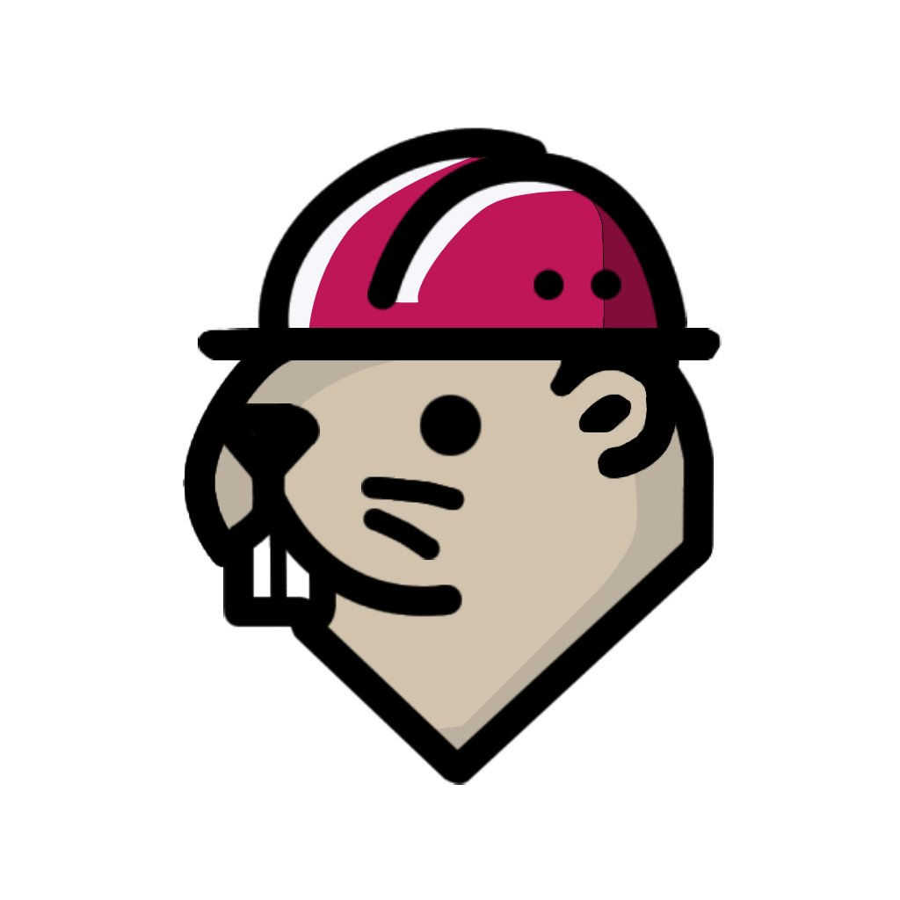

  

# 🚀 BEAVASK

**Beavask** is a **Task Management System** designed to enhance the workflow of development teams by **streamlining task creation, assignment, and tracking processes** for GitHub projects. The system integrates with **GitHub API** to provide a seamless project management experience.  

## ✨ KEY FEATURES

- 🔗 **GITHUB API INTEGRATION** - Fetch and manage repository tasks efficiently.  
- ✅ **TASK ASSIGNMENT & TRACKING SYSTEM** - Improve workflow and productivity.  
- 📝 **TASK REQUEST SYSTEM** - Allows **Senior Developers** to submit task requests, which are reviewed and assigned by the **Project Manager**.  
- 🛠 **ISSUE TRACKING & MANAGEMENT** - Developers can report problems and assign them to a **dedicated issue pool** for resolution.  
- 🔐 **ROLE-BASED USER ACCESS** - Organized workflow with roles like **Admin, Project Manager, Senior Developer, Junior Developer, Frontend Developer, Backend Developer**.  

Beavask is built to **optimize software development workflows** and help teams manage their **GitHub projects more effectively**. 🚀  

---

